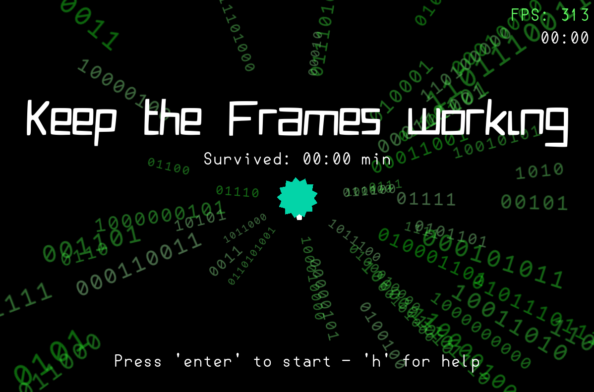

 

Keep the Frames working is a 2d game i made using lua and löve2d. The goal of this game is to survive as long as possible against some evil malware, that decreases your FPS every time it hits you. It may not impact you on the first few hits, but be careful, as soon as you feel it, it's too late.

 

 

# Controls
- Mouse - Turn around the cannon
- Mouseclick - shoot a projectile
## Menu
- Enter - start the game
- H - help menu

## Other 
- F5 - Debug informations (may reduce FPS!)

# Features
- Very satisfying menu 
- Shoot malware
- Keep your FPS stable
- A lot of cool effects (spent most time on this)
- Decreasing FPS

# Run
- Play the game on https://frames.jamedev.top 
- Download the executeables from the latest release (Windows)
- Download the .love file from the latest release and run via love (System independet)
- Build it yourself 

# Development
This game was made using 
- Lua 5.4.8
- Love2D 11.5

# Commits
This Github project uses Conventional Commits. I would recommend installing the following extension: 
[Conventional Commits](https://marketplace.visualstudio.com/items?itemName=vivaxy.vscode-conventional-commits)

# License
This project is published under the [MIT LICENSE](LICENSE)

# Other
This project is made for hackclubs siege event main week 8 (week 12 total)